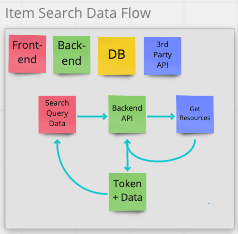
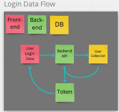
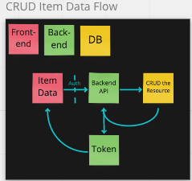

# Software Requirements

## Vision

*What is the vision of this product?*

* To provide Users with a unified, centralized place to keep track of all the shows/entertainment media they want to keep up with.

*What pain point does this project solve?*

* Not being able to remember all of the various entertainment media you want to engage with when you are ready to partake.

*Why should we care about your product?*

* Because we've all had the struggle of sitting down to watch a movie and not being able to think of one, or getting invested in a series and then forgetting to check for a new season the following year, finishing a book and not being able to remember the great novel that our friend recommended that we read next.

## Scope (In/Out)

IN - *What will your product do?*

* The web app will provide a centralized repository for the User to store their media choices.
* The web app will provide basic information on the User's media choices
* Users will be able to create thier own personalized profile
* Users will be able to save their media choices

OUT - *What will your product not do?*

* The web app will not be an IOS or Android app
* The web app will not have a streaming capability built-in (you will not be able to watch your shows inside this app)

### Minimum Viable Product vs

* Home page with Welcome message to orient new Users to the app
* About Us page with bios for the app authors
* TV Series page with separate cards for each film you add
* Each card populates [name, genre, release year, description, streaming service; if active, next release] from an API

### Stretch

* Track multiple types of entertainment media
  * Movies
  * TV Series
  * Music
  * Books
* Dedicted page for recommendations from friends
* Ability to sort and filter saved items
* Ability to reorder cards by dragging and dropping them

## Functional Requirements

For the purpose of this list "media" means movies, tv series, music albums or books.

1. User can create a profile in which to save their media choices
2. User can log in and log out of their profile
3. User can search for media on the Frontend site which queries an API on the Backend. The API on the Backend queries third-party APIs
4. User can create and delete media cards in a separate page dedicated to that media type
5. User can read about the creators of the app in an About Us page

### Data Flow

Item Search Data Flow

* Frontend: User's search data is collected and forwarded to the Backend API. User does not require authentication to search.
* Backend API: Requests search resources from a third-party API server.
* Backend API: Receives response resources from the third-party API server, transforms the shape into our domain model, adds a token to the data payload and returns the data to the Frontend.

Login Data Flow

* Frontend: User's login data is collected, hashed and securely sent to the Backend API. User does not require authentication to login.
* Backend: Queries the DB technology for User data matching the User's login credentials.
* Backend: Authenticates the User and sends a token to the Frontend.

CRUD Item Data Flow

* Frontend: User's item data is collected and forwarded to the Backend API. User requires authentication to use any Backend CRUD operations.
* Backend: Routes the request and prepares the resource for CRUD operations.
* Database: Based on the operation, the Database will CRUD the resource, returning success or failure to the Backend API.
* Backend: Returns a token and CRUD status code to the Frontend.

## Non-Functional Requirements

1. Security
We are adding a login that associates a User to a profile. This will secure the User profile from unathourized access. This will be implemented with a simple login form with username and password with a token to Backend server. A stretch goal is to replace this simple form with Auth0.

2. Maintainablility
We are using component architecture with React. This will lower the effort of functional changes. The components source code is separated logically and physically on the file system so the team can maintain many components at the same time. This will make confllicts less likely, increasing maintainability.
